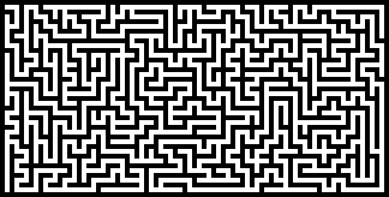

Depth-First Search Maze Generation
===

Objectives
---

Create a program that generates a random rectangular maze* using depth-first search algorithm.
The generated maze should be written to the standard output in [PBM format](https://en.wikipedia.org/wiki/Netpbm_format).
One pixel per one maze grid position is OK.
Dimensions of the maze as well as starting point need not be user-supplied, ie. may be constants.

*example (upscaled):

Hints
---

The algorithm always advances by two positions in a random direction, never consider advancing by just one.
